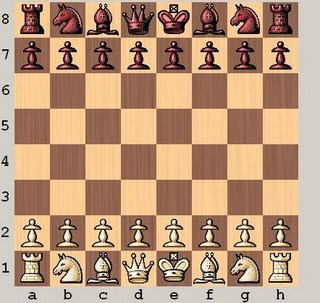

# Movimentos do Cavaleiro

*Questão 1100 | Beecrowd*  
*[Link para o problema](https://www.beecrowd.com.br/judge/en/problems/view/1100)*

### **Descrição**

Peter está fazendo uma pesquisa sobre o Problema do Cavaleiro Viajante (TKP) , onde você tem que encontrar o caminho fechado mais curto dos movimentos do cavalo que visita cada quadrado de um determinado conjunto de n quadrados em um tabuleiro de xadrez exatamente uma vez. Ele acha que a parte mais difícil do problema é determinar o menor número de movimentos do cavalo entre duas casas dadas e que, uma vez feito isso, encontrar o passeio seria fácil.

Claro que você sabe que é vice-versa. Portanto, você deve oferecer a ele um programa que resolva a parte "difícil".

Seu trabalho é escrever um programa que recebe dois quadrados a e b como entrada e então determina o número de movimentos do cavalo em uma rota mais curta de a para b .

### **Entrada**

O arquivo de entrada conterá um ou mais casos de teste. Cada caso de teste consiste em uma linha contendo dois quadrados separados por um espaço. Um quadrado é uma string que consiste em uma letra ( ah ) representando a coluna e um dígito ( 1-8 ) representando a linha no tabuleiro de xadrez. Veja a figura acima.

### **Saída**

Para cada caso de teste, imprima uma linha dizendo " Para ir de xx a yy leva n movimentos de cavalo ".

| **Exemplos de Entrada** | **Exemplos de Saída** |
|-------------------------|---------------------|
|e2 e4   a1 b2   b2 c3   a1 h8   a1 h7   h8 a1   b1 c3   f6 f6| To get from e2 to e4 takes 2 knight moves. To get from a1 to b2 takes 4 knight moves. To get from b2 to c3 takes 2 knight moves. To get from a1 to h8 takes 6 knight moves. To get from a1 to h7 takes 5 knight moves. To get from h8 to a1 takes 6 knight moves. To get from b1 to c3 takes 1 knight moves. To get from f6 to f6 takes 0 knight moves. |

