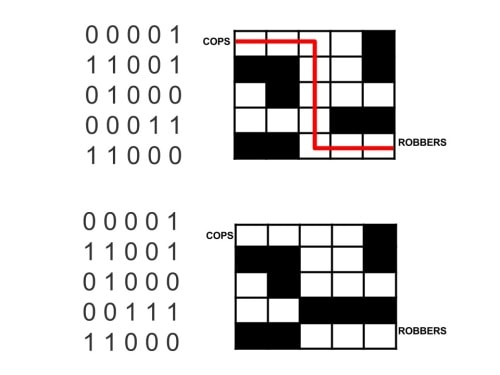
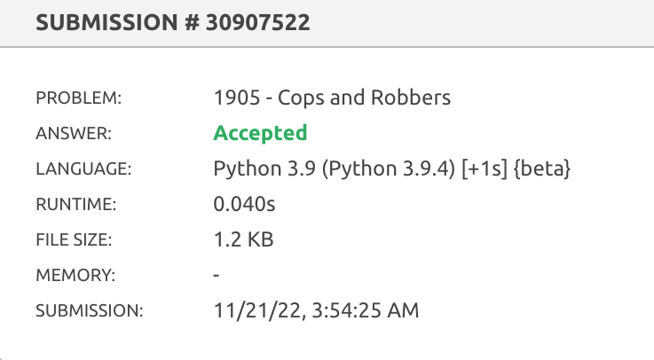

# Policiais e ladrões

*Questão 1100 | Beecrowd*  
*[Link para o problema](https://www.beecrowd.com.br/judge/en/problems/view/1905)*

### **Descrição**

Mario sempre convida seus amigos para brincar em sua casa. Desta vez, ele decidiu convidar seus amigos para jogar Cops and Robbers.

O jogo consiste em dois grupos, os policiais e os ladrões. Os ladrões estão se escondendo e os policiais devem pegá-los. Se os policiais pegarem os ladrões, eles ganharão o jogo. Caso contrário, os ladrões o farão. Mario se juntou ao grupo de policiais e tem que pegar os ladrões.

O grupo de assaltantes sentiu desvantagens por não ter locais estratégicos para se esconder no quintal.

Então eles decidiram criar um labirinto com caixas de papelão, para deixar os policiais trancados no labirinto e ganhar o jogo. As paredes do labirinto são rotuladas como '0' e '1'. onde '0' representa as paredes que os policiais podem atravessar e '1' as paredes que estão trancadas

Os ladrões sempre se esconderão no último slot do labirinto, se os policiais ficarem presos no labirinto, os ladrões podem escapar e ganhar o jogo, mas se o grupo de policiais pegar os ladrões, os policiais vencerão o jogo. Sua tarefa é descobrir no labirinto quem vai ganhar o jogo.

### **Entrada**

A primeira linha contém um número inteiro T (1 ≤ T ≤ 400) representando o número de casos de teste.

As próximas T linhas consistem em uma matriz 5 x 5 , composta por valores inteiros sendo 0 ou 1

### **Saída**

Seu programa deve imprimir "COPS" se os Cops forem os vencedores e "ROBBERS" caso os Robbers sejam os vencedores.

| **Exemplos de Entrada** | **Exemplos de Saída** |
|-------------------------|---------------------|
| 2    0 0 0 0 1  1 1 0 0 1 0 1 0 0 0 0 0 0 1 1 1 1 0 0 0  0 0 0 0 1 1 1 0 0 1 0 1 0 0 0 0 0 1 1 1 1 1 0 0 0  | COPS   ROBBERS|

### **Resultado**
