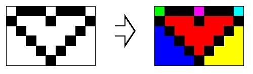

# Coloração de Cenários de Jogos

*Questão 1907 | Beecrowd*  
*[Link para o problema](https://www.beecrowd.com.br/repository/UOJ_1907.html)*

### **Descrição**

O Prof. Fernando Bevilacqua está muito preocupado com os cenários do seu mais novo jogo. Os contornos dos cenários já foram desenhados por um artista, restando ao Prof. Fernando apenas colori-los. No momento, cada cenário é uma imagem em que cada pixel está preto ou branco. Assim, quando o Prof. Fernando, em seu programa de coloração de imagens, clica num pixel branco para ser colorido com uma cor α, toda a região branca em que está o pixel selecionado recebe a cor α. Dizemos que um pixel branco A está na mesma região branca que um pixel branco B se existe um caminho entre A e B que passa apenas por pixels brancos e que considera as adjacências apenas nos sentidos horizontal e vertical. Por exemplo, são necessários 6 cliques para colorir a figura da esquerda.

### **Entrada**

A primeira linha da entrada consiste de dois inteiros positivos N e M (N, M ≤ 1.024), os quais representam a resolução da imagem. Cada uma das N linhas seguintes contém M caracteres, os quais podem ser . (ponto) ou o (letra ‘o’ minúscula), representando respectivamente um pixel branco ou um pixel preto.

### **Saída**

Imprima uma linha contendo um único inteiro que represente o número de cliques necessários para colorir toda a figura descrita na entrada.

| **Exemplos de Entrada** | **Exemplos de Saída** |
|-------------------------|---------------------|
|6 9  .ooo.ooo. o...o...o .o.....o. ..o...o.. ...o.o... ....o....| 6 |
|1 8 .o.o.o.o| 4 |
|1 1 o| 0 |
